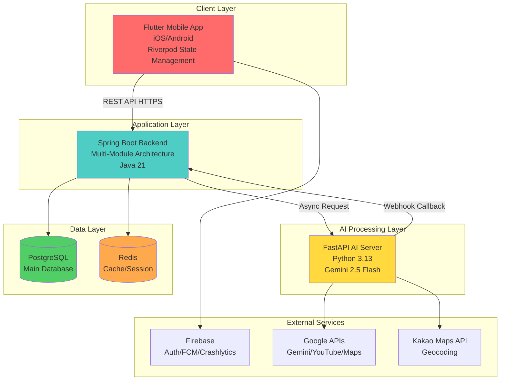
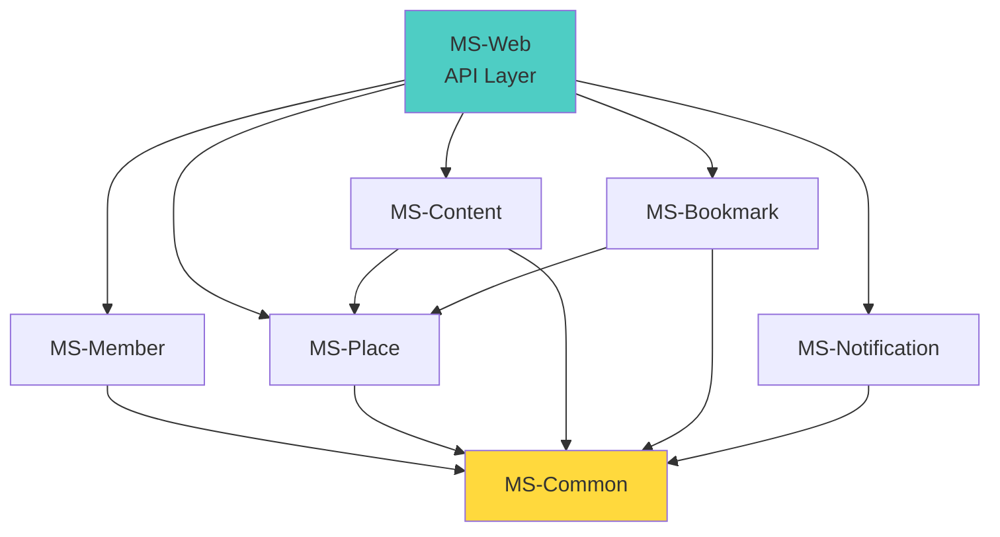
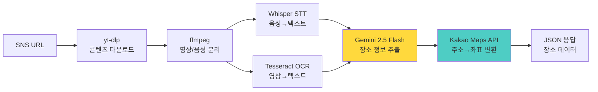
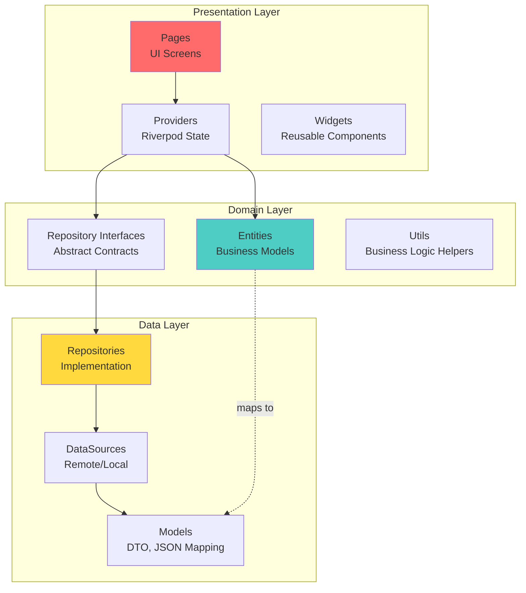
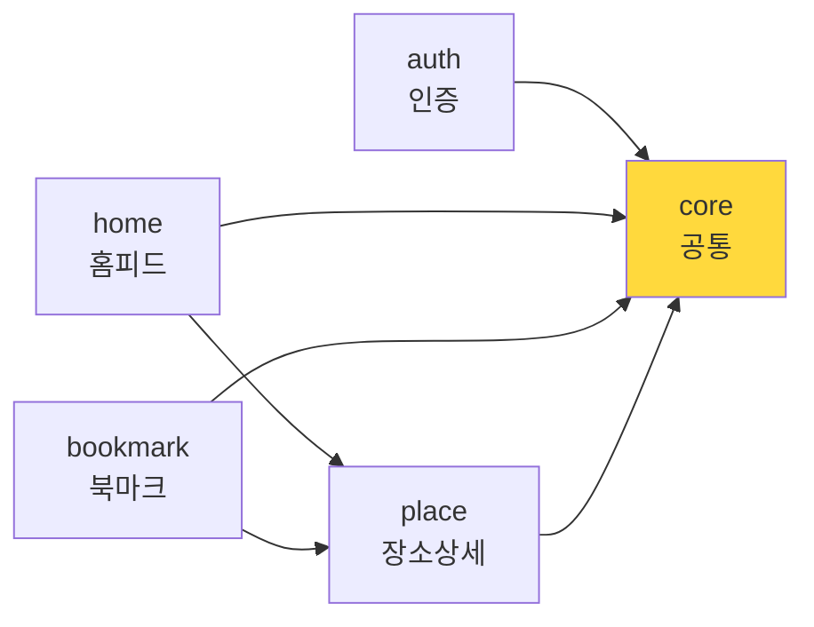
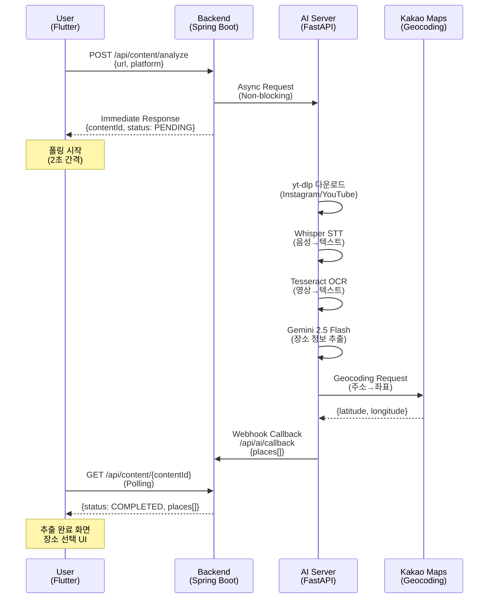
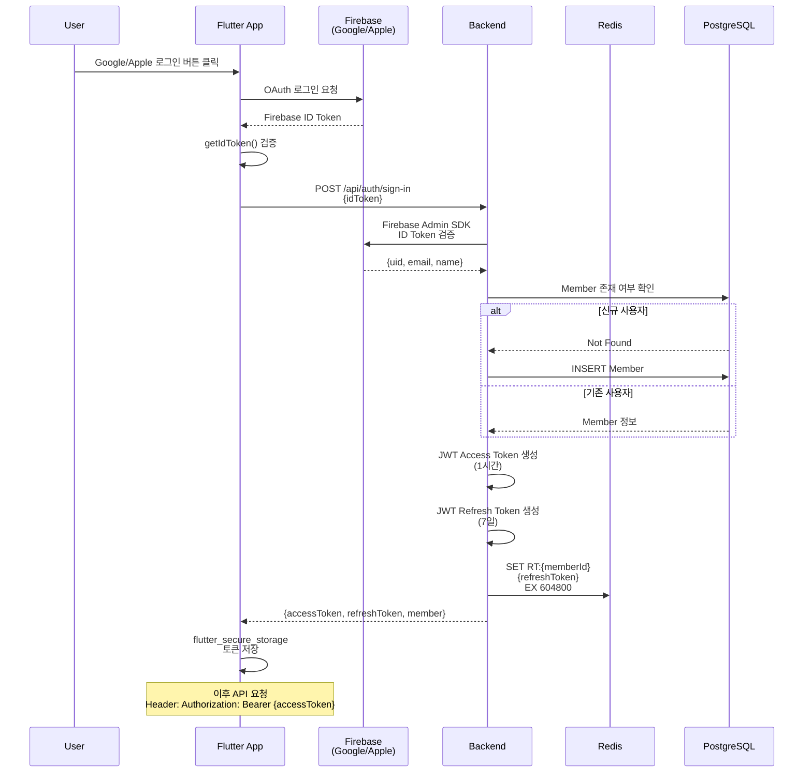
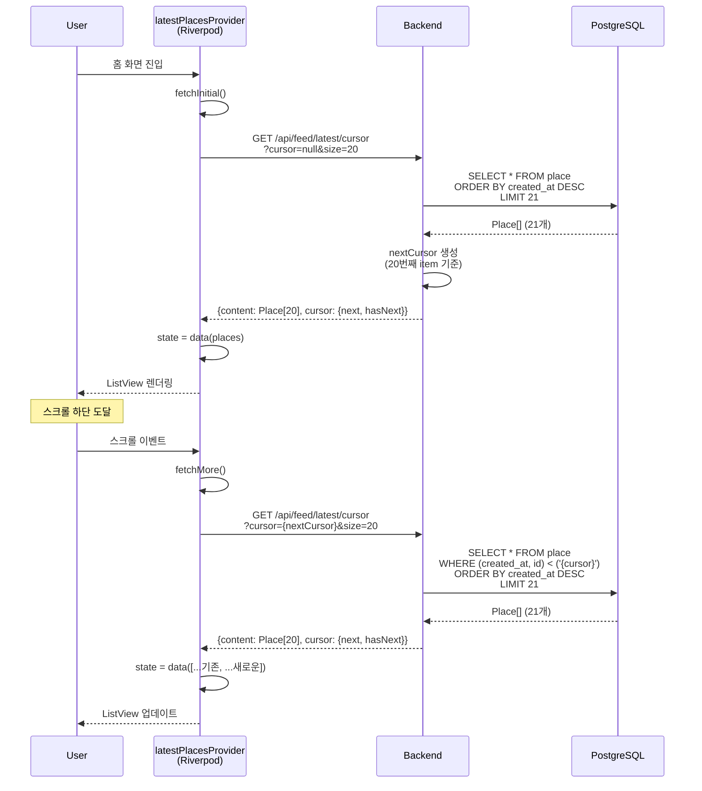

# 01. Mapsy 시스템 아키텍처

**문서 버전**: v1.0
**마지막 업데이트**: 2026-01-20
**출처**: [Mapsy_통합_PRD_v1.0.md](./Mapsy_통합_PRD_v1.0.md)

---

## 📑 목차

1. [전체 시스템 구조](#1-전체-시스템-구조)
2. [기술 스택](#2-기술-스택)
3. [Clean Architecture 레이어](#3-clean-architecture-레이어)
4. [모듈 의존성](#4-모듈-의존성)
5. [데이터 플로우](#5-데이터-플로우)

---

## 1. 전체 시스템 구조

### 1.1 시스템 개요

Mapsy는 **3-Tier 아키텍처**로 구성된 AI 기반 장소 추출 플랫폼입니다:



### 1.2 시스템 구성 요소

| 레이어 | 컴포넌트 | 역할 | 기술 스택 |
|--------|---------|------|----------|
| **Client** | Flutter Mobile App | 사용자 인터페이스, 상태 관리 | Flutter 3.9.2, Riverpod 2.6.1 |
| **Backend** | Spring Boot API | 비즈니스 로직, 데이터 관리 | Spring Boot 4.0.1, Java 21 |
| **AI** | FastAPI AI Server | SNS 콘텐츠 분석, 장소 추출 | FastAPI, Gemini 2.5 Flash |
| **Database** | PostgreSQL | 메인 데이터 저장소 | PostgreSQL 15+ |
| **Cache** | Redis | 세션, 캐시, 토큰 저장 | Redis 7+ |
| **Auth** | Firebase Auth | 소셜 로그인 (Google/Apple) | Firebase SDK |
| **Notification** | Firebase FCM | 푸시 알림 | Firebase Messaging |
| **Monitoring** | Firebase Crashlytics | 에러 리포팅 | Firebase Crashlytics |

---

## 2. 기술 스택

### 2.1 Frontend (Flutter)

#### 핵심 프레임워크
```yaml
Flutter SDK: ^3.9.2
언어: Dart 3.0+
플랫폼: iOS 13+, Android 7.0+ (API 24+)
```

#### 상태 관리 (Riverpod 코드 생성 패턴)
```yaml
# 핵심 상태 관리
flutter_riverpod: ^2.6.1
riverpod_annotation: ^2.6.1
riverpod_generator: ^2.6.2

# 코드 생성
build_runner: ^2.4.14
```

**Riverpod 아키텍처 특징**:
- `@riverpod` 어노테이션 기반 코드 생성
- Provider 자동 생성 (`authStateProvider` 등)
- 타입 안전성 보장
- 컴파일 타임 에러 감지

#### 네트워크 & API
```yaml
# HTTP 클라이언트
dio: ^5.9.0

# REST API 클라이언트 생성
retrofit: ^4.7.2
retrofit_generator: ^9.1.8

# JSON 직렬화
json_serializable: ^6.9.2
freezed: ^2.5.7
freezed_annotation: ^2.4.4
```

#### 라우팅 & 네비게이션
```yaml
go_router: ^17.0.1
```

**GoRouter 특징**:
- 선언적 라우팅
- Deep Link 지원
- 인증 가드 (redirect 함수)
- Riverpod과 통합 (`refreshListenable`)

#### 인증 & 보안
```yaml
# Firebase 인증
firebase_auth: ^6.1.3
firebase_core: ^3.8.1

# 소셜 로그인
google_sign_in: ^6.2.3
sign_in_with_apple: ^6.1.3

# 보안 저장소
flutter_secure_storage: ^9.2.2
```

#### UI & 디자인
```yaml
# 반응형 디자인
flutter_screenutil: ^5.9.3

# 애니메이션
lottie: ^3.2.1

# 이미지
cached_network_image: ^3.4.1
flutter_svg: ^2.2.1

# 인디케이터
smooth_page_indicator: ^1.2.1
```

#### 알림
```yaml
firebase_messaging: ^16.0.1
flutter_local_notifications: ^19.4.2
```

---

### 2.2 Backend (Spring Boot)

#### 핵심 프레임워크
```
Spring Boot: 4.0.1
Java: 21 (LTS)
빌드 도구: Gradle 8.5+
```

#### Multi-Module 구조
```
mapsy-backend/
├── MS-Common          # 공통 유틸리티, 상수, 예외
├── MS-Member          # 회원 관리
├── MS-Place           # 장소 관리
├── MS-Content         # 콘텐츠/AI 추출
├── MS-Bookmark        # 북마크 관리
├── MS-Notification    # 알림 관리
└── MS-Web             # API 엔드포인트 (진입점)
```

**모듈 의존성 다이어그램**:


#### 주요 의존성
```
# 데이터베이스
spring-boot-starter-data-jpa
postgresql-driver

# 캐시 & 세션
spring-boot-starter-data-redis
spring-session-data-redis

# 인증
firebase-admin-sdk

# 보안
spring-boot-starter-security
jjwt (JWT 토큰)

# 검증
spring-boot-starter-validation

# API 문서
springdoc-openapi-starter-webmvc-ui
```

#### 데이터베이스
```
Primary: PostgreSQL 15+
- 메인 데이터 저장소
- 트랜잭션 관리
- JSONB 컬럼 활용 (유연한 데이터 구조)

Cache: Redis 7+
- 세션 저장 (Spring Session)
- Refresh Token 저장 (TTL: 7일)
- API 응답 캐싱 (트렌드 키워드, 인기 장소)
```

#### 인증 플로우
```
Firebase ID Token → Firebase Admin SDK 검증
→ Member 조회/생성
→ JWT Access Token 발급 (1시간)
→ JWT Refresh Token 발급 (7일, Redis 저장)
```

---

### 2.3 AI Server (FastAPI)

#### 핵심 프레임워크
```
Python: 3.13+
FastAPI: 최신 버전
Uvicorn: ASGI 서버
```

#### AI/ML 스택
```python
# LLM
google-generativeai  # Gemini 2.5 Flash

# STT (Speech-to-Text)
faster-whisper       # Whisper 모델 최적화 버전

# OCR (Optical Character Recognition)
pytesseract         # Tesseract 한글 언어팩
Pillow              # 이미지 처리
```

#### 외부 API 통합
```python
# SNS 콘텐츠 다운로드
yt-dlp              # YouTube, Instagram 다운로드

# 비디오 처리
ffmpeg-python
ffprobe-python

# Geocoding
requests            # Kakao Maps API, Nominatim
```

#### AI 처리 파이프라인


**처리 시간**: 평균 30초 (영상 길이, 네트워크 상태에 따라 변동)

---

## 3. Clean Architecture 레이어

### 3.1 아키텍처 개요

Mapsy Flutter 앱은 **Clean Architecture** 원칙을 따라 3개 레이어로 구성됩니다:



### 3.2 레이어별 책임

#### Presentation Layer (UI + State)
**위치**: `lib/features/{feature}/presentation/`

**책임**:
- UI 렌더링 (Pages, Widgets)
- 사용자 인터랙션 처리
- 상태 관리 (Riverpod Providers)
- 라우팅 및 네비게이션

**주요 구성 요소**:
```dart
// Pages: 화면 단위
class LoginPage extends ConsumerWidget { ... }

// Providers: 상태 관리 (코드 생성)
@riverpod
class AuthNotifier extends _$AuthNotifier {
  @override
  FutureOr<User?> build() { ... }

  Future<void> signInWithGoogle() { ... }
}

// Widgets: 재사용 가능한 UI 컴포넌트
class LoginButton extends StatelessWidget { ... }
```

**의존성 규칙**:
- ✅ Domain Layer 의존 가능 (Entity, Repository Interface)
- ❌ Data Layer 직접 의존 금지

---

#### Domain Layer (Business Logic)
**위치**: `lib/features/{feature}/domain/`

**책임**:
- 비즈니스 모델 정의 (Entities)
- Repository 인터페이스 정의
- 비즈니스 로직 유틸리티

**주요 구성 요소**:
```dart
// Entities: 순수 비즈니스 모델
class User {
  final String id;
  final String email;
  final String name;

  const User({required this.id, required this.email, required this.name});
}

// Repository Interface: 추상 계약
abstract class AuthRepository {
  Future<UserCredential> signInWithGoogle();
  Future<void> signOut();
  Stream<User?> authStateChanges();
}

// Utils: 비즈니스 로직 헬퍼
class FirebaseAuthErrorHandler {
  static AuthException createAuthException(FirebaseAuthException e) { ... }
}
```

**의존성 규칙**:
- ✅ 외부 의존성 없음 (순수 Dart 코드)
- ❌ Flutter 프레임워크 의존 금지
- ❌ 외부 라이브러리 의존 최소화

---

#### Data Layer (Infrastructure)
**위치**: `lib/features/{feature}/data/`

**책임**:
- Repository 구현체
- 데이터 소스 (Remote API, Local Storage)
- DTO/Model (JSON 직렬화)

**주요 구성 요소**:
```dart
// Repository Implementation
class AuthRepositoryImpl implements AuthRepository {
  final FirebaseAuthDataSource dataSource;

  const AuthRepositoryImpl(this.dataSource);

  @override
  Future<UserCredential> signInWithGoogle() {
    return dataSource.signInWithGoogle();
  }
}

// DataSource: 실제 데이터 접근
class FirebaseAuthDataSource {
  final FirebaseAuth _firebaseAuth = FirebaseAuth.instance;
  final GoogleSignIn _googleSignIn = GoogleSignIn();

  Future<UserCredential> signInWithGoogle() async {
    final GoogleSignInAccount? googleUser = await _googleSignIn.signIn();
    // ... 인증 로직
  }
}

// Model: JSON 직렬화 (Freezed)
@freezed
class PlaceModel with _$PlaceModel {
  const factory PlaceModel({
    required String id,
    required String name,
    @JsonKey(name: 'place_address') required String address,
  }) = _PlaceModel;

  factory PlaceModel.fromJson(Map<String, dynamic> json) =>
      _$PlaceModelFromJson(json);
}
```

**의존성 규칙**:
- ✅ Domain Layer 의존 (Entity, Repository Interface 구현)
- ✅ 외부 라이브러리 사용 가능 (Firebase, Dio 등)

---

### 3.3 의존성 흐름

```
Presentation → Domain ← Data
     ↓           ↓         ↓
  Riverpod   Entities   Models
  Providers  Repository Repository
             Interface  Impl
```

**핵심 원칙**:
1. **의존성 역전**: Presentation/Data가 Domain에 의존 (Domain은 독립적)
2. **단방향 흐름**: 상위 레이어 → 하위 레이어 의존
3. **인터페이스 분리**: Repository Interface (Domain) vs Implementation (Data)

---

## 4. 모듈 의존성

### 4.1 Flutter 주요 Feature 모듈



**모듈별 책임**:

| 모듈 | 책임 | 주요 Provider |
|------|------|---------------|
| **auth** | 인증, 온보딩, 회원가입 | `authStateProvider`, `authNotifierProvider` |
| **home** | 홈 피드, 트렌드 키워드 | `latestPlacesProvider`, `popularPlacesProvider` |
| **bookmark** | 북마크 관리, 폴더 | `bookmarkedPlacesProvider`, `bookmarkFoldersProvider` |
| **place** | 장소 상세 정보 | `placeDetailProvider` |
| **ai_extraction** | AI 장소 추출 | `aiExtractionProvider` |

### 4.2 Core 공통 모듈

```
core/
├── constants/         # 앱 전역 상수
│   ├── app_colors.dart
│   ├── text_styles.dart
│   └── spacing_and_radius.dart
├── services/          # 공통 서비스
│   ├── fcm/
│   │   ├── firebase_messaging_service.dart
│   │   └── local_notifications_service.dart
│   └── storage/
│       └── secure_storage_service.dart
├── errors/            # 예외 처리
│   └── app_exception.dart
└── utils/             # 유틸리티
    └── validators.dart
```

---

## 5. 데이터 플로우

### 5.1 AI 장소 추출 플로우 (비동기 처리)



**처리 단계별 설명**:

1. **요청 단계** (0-1초)
   - Flutter: URL 입력 → `POST /api/content/analyze`
   - Backend: contentId 즉시 반환, AI Server에 비동기 요청

2. **AI 처리 단계** (20-40초)
   - AI Server: 콘텐츠 다운로드 (yt-dlp)
   - 음성 추출 → Whisper STT
   - 영상 OCR → Tesseract
   - LLM 분석 → Gemini 2.5 Flash (장소명, 주소 추출)
   - Geocoding → Kakao Maps API (주소→좌표)

3. **폴링 단계** (2초 간격)
   - Flutter: `GET /api/content/{contentId}` 반복 호출
   - Backend: status 확인 (PENDING/PROCESSING/COMPLETED/FAILED)

4. **완료 단계**
   - AI Server: Webhook 호출 → Backend에 결과 전달
   - Backend: DB 저장, status = COMPLETED
   - Flutter: 다음 폴링에서 결과 수신 → UI 업데이트

---

### 5.2 인증 플로우 (Firebase OAuth → JWT)



---

### 5.3 홈 피드 데이터 플로우 (Cursor 페이지네이션)



**Cursor 페이지네이션 특징**:
- ✅ 실시간 데이터 변경에 안전 (Offset보다 일관성 높음)
- ✅ 무한 스크롤에 최적화
- ✅ 성능: WHERE 절로 특정 위치부터 조회 (OFFSET보다 빠름)

---

## 📚 관련 문서

- **[02_FOLDER_STRUCTURE.md](./02_FOLDER_STRUCTURE.md)**: 실제 Flutter 프로젝트 폴더 구조
- **[04_CODE_GENERATION_GUIDE.md](./04_CODE_GENERATION_GUIDE.md)**: Riverpod/Retrofit 코드 생성 가이드
- **[Mapsy_통합_PRD_v1.0.md](./Mapsy_통합_PRD_v1.0.md)**: 전체 PRD 원본 문서

---

**문서 끝**
