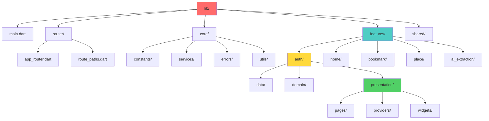

# 02. Mapsy 폴더 구조

**문서 버전**: v1.0
**마지막 업데이트**: 2026-01-20
**출처**: [Mapsy_통합_PRD_v1.0.md](./Mapsy_통합_PRD_v1.0.md)

---

## 📑 목차

1. [전체 폴더 트리](#1-전체-폴더-트리)
2. [features/ 구조 (Clean Architecture)](#2-features-구조-clean-architecture)
3. [core/ 공통 모듈](#3-core-공통-모듈)
4. [router/ 네비게이션](#4-router-네비게이션)
5. [파일 배치 규칙](#5-파일-배치-규칙)

---

## 1. 전체 폴더 트리

### 1.1 루트 구조

```
lib/
├── main.dart                          # 앱 진입점 (Firebase, FCM 초기화)
├── firebase_options.dart              # Firebase 플랫폼별 설정 (자동 생성)
│
├── router/                            # 네비게이션 & 라우팅
│   ├── app_router.dart                # GoRouter 설정
│   └── route_paths.dart               # 라우트 경로 상수
│
├── core/                              # 공통 모듈 (앱 전역 사용)
│   ├── constants/                     # 상수 정의
│   │   ├── app_colors.dart            # 컬러 팔레트
│   │   ├── text_styles.dart           # 타이포그래피
│   │   └── spacing_and_radius.dart    # 간격, 반경
│   │
│   ├── services/                      # 공통 서비스
│   │   ├── fcm/                       # Firebase Cloud Messaging
│   │   │   ├── firebase_messaging_service.dart
│   │   │   └── local_notifications_service.dart
│   │   └── storage/                   # 로컬 저장소
│   │       └── secure_storage_service.dart
│   │
│   ├── errors/                        # 예외 처리
│   │   └── app_exception.dart         # 커스텀 예외
│   │
│   └── utils/                         # 유틸리티
│       └── validators.dart            # 검증 함수
│
├── features/                          # 기능별 모듈 (Clean Architecture)
│   ├── auth/                          # 인증 기능
│   ├── home/                          # 홈 피드
│   ├── bookmark/                      # 북마크 관리
│   ├── place/                         # 장소 상세
│   └── ai_extraction/                 # AI 장소 추출
│
└── shared/                            # 공유 위젯 (Feature 간 공유)
    └── widgets/
        ├── loading_indicator.dart
        └── error_widget.dart
```

---

## 2. features/ 구조 (Clean Architecture)

**Clean Architecture 개념 상세**: [01_ARCHITECTURE.md > 3. Clean Architecture 레이어](./01_ARCHITECTURE.md#3-clean-architecture-레이어)

Mapsy 프로젝트는 Clean Architecture의 3-레이어 구조를 따릅니다:
- **Presentation Layer**: UI + State (pages, providers, widgets)
- **Domain Layer**: Business Logic (entities, repositories)
- **Data Layer**: Infrastructure (datasources, models, repository implementations)

### 2.1 auth/ 모듈 (완전한 예시)

```
features/auth/
│
├── data/                              # Data Layer (Infrastructure)
│   ├── datasources/                   # 데이터 소스
│   │   └── firebase_auth_datasource.dart
│   │       # Firebase Auth 직접 호출
│   │       # - signInWithGoogle()
│   │       # - signInWithApple()
│   │       # - signOut()
│   │       # - getIdToken()
│   │
│   ├── models/                        # DTO/Models (JSON 직렬화)
│   │   ├── user_model.dart            # Freezed 모델
│   │   └── user_model.g.dart          # 자동 생성
│   │
│   └── repositories/                  # Repository 구현체
│       └── auth_repository_impl.dart  # AuthRepository 인터페이스 구현
│
├── domain/                            # Domain Layer (Business Logic)
│   ├── entities/                      # 순수 비즈니스 모델
│   │   └── user.dart                  # User Entity (Flutter/외부 의존 없음)
│   │
│   ├── repositories/                  # Repository 인터페이스 (추상)
│   │   └── auth_repository.dart       # abstract class AuthRepository
│   │
│   └── utils/                         # 비즈니스 로직 유틸리티
│       └── firebase_auth_error_handler.dart
│           # FirebaseAuthException → AuthException 변환
│
└── presentation/                      # Presentation Layer (UI + State)
    ├── pages/                         # 화면 (Page)
    │   ├── splash_page.dart           # 스플래시 화면
    │   ├── onboarding_page.dart       # 온보딩 슬라이드
    │   ├── login_page.dart            # 로그인/회원가입
    │   └── user_info_input_page.dart  # 초기 정보 입력
    │
    ├── providers/                     # Riverpod Provider (상태 관리)
    │   ├── auth_provider.dart         # @riverpod 어노테이션
    │   └── auth_provider.g.dart       # build_runner 자동 생성
    │       # - authStateProvider (StreamProvider)
    │       # - authNotifierProvider (NotifierProvider)
    │       # - firebaseAuthDataSourceProvider (Provider)
    │
    └── widgets/                       # 재사용 위젯
        ├── login_button.dart          # Google/Apple 로그인 버튼
        └── onboarding_slide.dart      # 온보딩 슬라이드 위젯
```

---

### 2.2 home/ 모듈 구조

```
features/home/
│
├── data/
│   ├── datasources/
│   │   └── feed_remote_datasource.dart  # API 호출 (Retrofit)
│   │
│   ├── models/
│   │   ├── place_model.dart             # Place DTO
│   │   ├── place_model.g.dart
│   │   ├── keyword_model.dart           # Keyword DTO
│   │   └── keyword_model.g.dart
│   │
│   └── repositories/
│       └── feed_repository_impl.dart
│
├── domain/
│   ├── entities/
│   │   ├── place.dart                   # Place Entity
│   │   └── keyword.dart                 # Keyword Entity
│   │
│   └── repositories/
│       └── feed_repository.dart
│
└── presentation/
    ├── pages/
    │   ├── home_page.dart               # 홈 메인 화면
    │   └── keyword_feed_page.dart       # 키워드 피드 화면
    │
    ├── providers/
    │   ├── home_provider.dart           # 홈 피드 Provider
    │   └── home_provider.g.dart
    │       # - latestPlacesProvider (NotifierProvider)
    │       # - popularPlacesProvider (FutureProvider)
    │       # - myTopPlacesProvider (FutureProvider)
    │       # - trendingKeywordsProvider (FutureProvider)
    │
    └── widgets/
        ├── place_card.dart              # 장소 카드 위젯
        ├── keyword_chip.dart            # 키워드 칩 위젯
        └── latest_places_section.dart   # 최신 장소 섹션
```

---

### 2.3 bookmark/ 모듈 구조

```
features/bookmark/
│
├── data/
│   ├── datasources/
│   │   └── bookmark_remote_datasource.dart
│   │
│   ├── models/
│   │   ├── member_place_model.dart      # 북마크 DTO
│   │   ├── member_place_model.g.dart
│   │   ├── folder_model.dart            # 폴더 DTO
│   │   └── folder_model.g.dart
│   │
│   └── repositories/
│       └── bookmark_repository_impl.dart
│
├── domain/
│   ├── entities/
│   │   ├── member_place.dart            # 북마크 Entity
│   │   └── folder.dart                  # 폴더 Entity
│   │
│   └── repositories/
│       └── bookmark_repository.dart
│
└── presentation/
    ├── pages/
    │   └── bookmark_page.dart           # 북마크 메인 화면
    │
    ├── providers/
    │   ├── bookmark_provider.dart
    │   └── bookmark_provider.g.dart
    │       # - bookmarkFoldersProvider (FutureProvider)
    │       # - bookmarkedPlacesProvider (NotifierProvider)
    │       # - currentFolderProvider (StateProvider)
    │
    └── widgets/
        ├── bookmarked_place_card.dart   # 북마크 카드
        ├── folder_tab.dart              # 폴더 탭
        └── memo_edit_bottom_sheet.dart  # 메모 편집 바텀 시트
```

---

### 2.4 place/ 모듈 구조

```
features/place/
│
├── data/
│   ├── datasources/
│   │   └── place_remote_datasource.dart
│   │
│   ├── models/
│   │   ├── place_detail_model.dart      # 장소 상세 DTO
│   │   └── place_detail_model.g.dart
│   │
│   └── repositories/
│       └── place_repository_impl.dart
│
├── domain/
│   ├── entities/
│   │   ├── place_detail.dart            # 장소 상세 Entity
│   │   └── business_hours.dart          # 영업 정보 Entity
│   │
│   └── repositories/
│       └── place_repository.dart
│
└── presentation/
    ├── pages/
    │   ├── place_detail_page.dart       # 장소 상세 화면
    │   └── photo_gallery_page.dart      # 사진 갤러리 전체 화면
    │
    ├── providers/
    │   ├── place_provider.dart
    │   └── place_provider.g.dart
    │       # - placeDetailProvider (FutureProvider, family)
    │       # - isSavedProvider (FutureProvider, family)
    │
    └── widgets/
        ├── business_hours_section.dart  # 영업 정보 섹션
        ├── location_map_section.dart    # 지도 섹션
        └── keyword_chips_section.dart   # 키워드 섹션
```

---

### 2.5 ai_extraction/ 모듈 구조

```
features/ai_extraction/
│
├── data/
│   ├── datasources/
│   │   └── content_remote_datasource.dart
│   │
│   ├── models/
│   │   ├── extraction_result_model.dart
│   │   └── extraction_result_model.g.dart
│   │
│   └── repositories/
│       └── content_repository_impl.dart
│
├── domain/
│   ├── entities/
│   │   ├── extraction_result.dart
│   │   └── extraction_status.dart       # enum (PENDING, PROCESSING, COMPLETED, FAILED)
│   │
│   └── repositories/
│       └── content_repository.dart
│
└── presentation/
    ├── pages/
    │   ├── ai_processing_page.dart      # 처리 중 화면 (폴링)
    │   ├── ai_result_page.dart          # 추출 완료 화면
    │   └── ai_error_page.dart           # 추출 실패 화면
    │
    ├── providers/
    │   ├── ai_extraction_provider.dart
    │   └── ai_extraction_provider.g.dart
    │       # - aiExtractionProvider (NotifierProvider)
    │       # - urlValidationProvider (StateProvider)
    │       # - selectedPlacesProvider (StateProvider)
    │
    └── widgets/
        ├── url_input_bottom_sheet.dart  # URL 입력 바텀 시트
        └── extraction_result_card.dart  # 추출 결과 카드
```

---

## 3. core/ 공통 모듈

### 3.1 constants/ (상수 정의)

```dart
// lib/core/constants/app_colors.dart
class AppColors {
  static const primary500 = Color(0xFFFF6B6B);
  static const secondary500 = Color(0xFF4ECDC4);
  // ...
}

// lib/core/constants/text_styles.dart
class AppTextStyles {
  static const h1 = TextStyle(fontSize: 28, fontWeight: FontWeight.w700);
  // ...
}

// lib/core/constants/spacing_and_radius.dart
class AppSpacing {
  static const vertical16 = 16.0.h; // ScreenUtil 사용
  // ...
}
```

**파일 목록**:
- `app_colors.dart`: 브랜드 컬러, 상태 컬러
- `text_styles.dart`: 타이포그래피 스타일
- `spacing_and_radius.dart`: 간격, 패딩, 반경

---

### 3.2 services/ (공통 서비스)

#### FCM (Firebase Cloud Messaging)
```
core/services/fcm/
├── firebase_messaging_service.dart    # FCM 메시지 수신, 토큰 관리
└── local_notifications_service.dart   # 로컬 알림 표시
```

**주요 기능**:
- Foreground/Background/Terminated 상태 메시지 처리
- 알림 권한 요청
- FCM 토큰 관리 및 서버 전송

#### Storage (로컬 저장소)
```
core/services/storage/
└── secure_storage_service.dart        # flutter_secure_storage 래퍼
```

**저장 항목**:
- JWT Access Token
- JWT Refresh Token
- 사용자 설정 (온보딩 완료 여부 등)

---

### 3.3 errors/ (예외 처리)

```dart
// lib/core/errors/app_exception.dart

/// 앱 전역 커스텀 예외
class AppException implements Exception {
  final String message;
  final Exception? originalException;

  const AppException({
    required this.message,
    this.originalException,
  });

  @override
  String toString() => message;
}

/// 인증 관련 예외
class AuthException extends AppException {
  const AuthException({
    required String message,
    Exception? originalException,
  }) : super(message: message, originalException: originalException);
}

/// 네트워크 관련 예외
class NetworkException extends AppException {
  const NetworkException({
    required String message,
    Exception? originalException,
  }) : super(message: message, originalException: originalException);
}
```

---

### 3.4 utils/ (유틸리티)

```dart
// lib/core/utils/validators.dart

class Validators {
  /// 이메일 검증
  static bool isValidEmail(String email) {
    return RegExp(r'^[a-zA-Z0-9._%+-]+@[a-zA-Z0-9.-]+\.[a-zA-Z]{2,}$')
        .hasMatch(email);
  }

  /// 닉네임 검증 (2-12자, 한글/영문/숫자)
  static bool isValidNickname(String nickname) {
    if (nickname.length < 2 || nickname.length > 12) return false;
    return RegExp(r'^[가-힣a-zA-Z0-9]+$').hasMatch(nickname);
  }

  /// URL 검증 (Instagram/YouTube)
  static bool isValidSnsUrl(String url) {
    return RegExp(r'^https?://(www\.)?(instagram\.com|youtube\.com|youtu\.be)/')
        .hasMatch(url);
  }
}
```

---

## 4. router/ 네비게이션

### 4.1 app_router.dart (GoRouter 설정)

```dart
// lib/router/app_router.dart

final routerProvider = Provider<GoRouter>((ref) {
  return GoRouter(
    initialLocation: RoutePaths.splash,
    debugLogDiagnostics: true,

    // Riverpod 인증 상태 감지
    refreshListenable: _GoRouterRefreshNotifier(ref, authStateProvider),

    // 인증 가드 (리다이렉트)
    redirect: (BuildContext context, GoRouterState state) {
      final authUser = ref.read(authStateProvider).value;
      final isAuthenticated = authUser != null;

      final currentPath = state.uri.path;
      final publicPaths = [RoutePaths.splash, RoutePaths.login];

      // 비로그인 사용자 → 로그인 페이지로
      if (!isAuthenticated && !publicPaths.contains(currentPath)) {
        return RoutePaths.login;
      }

      // 로그인 사용자가 로그인 페이지 접근 → 홈으로
      if (isAuthenticated && currentPath == RoutePaths.login) {
        return RoutePaths.home;
      }

      return null; // 리다이렉트 불필요
    },

    routes: [
      GoRoute(
        path: RoutePaths.splash,
        name: RoutePaths.splashName,
        builder: (context, state) => const SplashPage(),
      ),
      GoRoute(
        path: RoutePaths.login,
        name: RoutePaths.loginName,
        builder: (context, state) => const LoginPage(),
      ),
      GoRoute(
        path: RoutePaths.home,
        name: RoutePaths.homeName,
        builder: (context, state) => const HomePage(),
      ),
      // ... 기타 라우트
    ],
  );
});
```

---

### 4.2 route_paths.dart (경로 상수)

```dart
// lib/router/route_paths.dart

class RoutePaths {
  // Root & Authentication
  static const splash = '/';
  static const splashName = 'splash';

  static const login = '/login';
  static const loginName = 'login';

  static const onboarding = '/onboarding';
  static const onboardingName = 'onboarding';

  // Main Navigation
  static const home = '/home';
  static const homeName = 'home';

  static const bookmark = '/bookmark';
  static const bookmarkName = 'bookmark';

  // Place Detail
  static String placeDetail(String placeId) => '/place/$placeId';
  static const placeDetailName = 'place-detail';

  // AI Extraction
  static String aiProcessing(String contentId) => '/ai-processing/$contentId';
  static const aiProcessingName = 'ai-processing';
}
```

---

## 5. 파일 배치 규칙

### 5.1 레이어별 배치

| 레이어 | 폴더 | 파일 타입 | 네이밍 규칙 | 예시 |
|--------|------|----------|------------|------|
| **Presentation** | `presentation/pages/` | Page | `{name}_page.dart` | `login_page.dart` |
| **Presentation** | `presentation/providers/` | Provider | `{feature}_provider.dart` | `auth_provider.dart` |
| **Presentation** | `presentation/widgets/` | Widget | `{name}_widget.dart` | `login_button.dart` |
| **Domain** | `domain/entities/` | Entity | `{name}.dart` | `user.dart` |
| **Domain** | `domain/repositories/` | Repository Interface | `{name}_repository.dart` | `auth_repository.dart` |
| **Data** | `data/models/` | Model (DTO) | `{name}_model.dart` | `user_model.dart` |
| **Data** | `data/datasources/` | DataSource | `{name}_datasource.dart` | `firebase_auth_datasource.dart` |
| **Data** | `data/repositories/` | Repository Impl | `{name}_repository_impl.dart` | `auth_repository_impl.dart` |

---

### 5.2 코드 생성 파일 배치

**Riverpod Provider**:
```
presentation/providers/
├── auth_provider.dart       # 수동 작성 (@riverpod 어노테이션)
└── auth_provider.g.dart     # build_runner 자동 생성
```

**Freezed Model**:
```
data/models/
├── user_model.dart          # 수동 작성 (@freezed 어노테이션)
├── user_model.freezed.dart  # build_runner 자동 생성
└── user_model.g.dart        # build_runner 자동 생성 (JSON)
```

**Retrofit API Client**:
```
data/datasources/
├── api_client.dart          # 수동 작성 (@RestApi 어노테이션)
└── api_client.g.dart        # build_runner 자동 생성
```

---

### 5.3 파일명 규칙 (snake_case)

✅ **올바른 예시**:
```
login_page.dart
auth_provider.dart
firebase_auth_datasource.dart
user_model.dart
```

❌ **잘못된 예시**:
```
LoginPage.dart          # UpperCamelCase (X)
authProvider.dart       # lowerCamelCase (X)
firebase-auth.dart      # kebab-case (X)
```

---

### 5.4 폴더 생성 기준

**Feature 모듈 생성 기준**:
- ✅ 독립적인 화면이 있을 때 (Page 존재)
- ✅ 독립적인 상태 관리가 필요할 때 (Provider 존재)
- ✅ 독립적인 비즈니스 로직이 있을 때 (Entity, Repository)

**예시**:
- `auth/`: 로그인, 회원가입 (독립 화면 ✅)
- `home/`: 홈 피드 (독립 화면 ✅)
- `bookmark/`: 북마크 관리 (독립 화면 ✅)

**Shared Widgets**:
- 여러 Feature에서 공통으로 사용하는 위젯
- `lib/shared/widgets/` 배치
- 예: `loading_indicator.dart`, `error_widget.dart`

---

## 📊 폴더 구조 시각화 (Mermaid)



---

## 📚 관련 문서

- **[01_ARCHITECTURE.md](./01_ARCHITECTURE.md)**: Clean Architecture 개념 및 시스템 아키텍처
- **[04_CODE_GENERATION_GUIDE.md](./04_CODE_GENERATION_GUIDE.md)**: Riverpod/Freezed 코드 생성 방법
- **[Mapsy_통합_PRD_v1.0.md](./Mapsy_통합_PRD_v1.0.md)**: 전체 PRD 원본 문서

---

**문서 끝**
