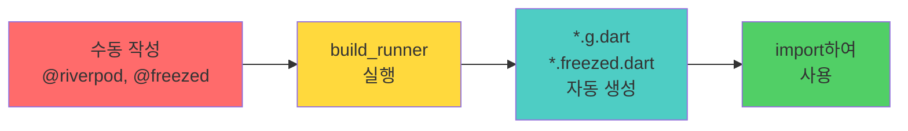
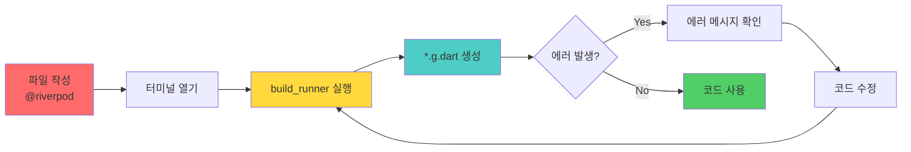

# 04. 코드 생성 가이드

**문서 버전**: v1.0
**마지막 업데이트**: 2026-01-20
**출처**: [Mapsy_통합_PRD_v1.0.md](./Mapsy_통합_PRD_v1.0.md)

---

## 📑 목차

1. [코드 생성 도구 개요](#1-코드-생성-도구-개요)
2. [Riverpod 코드 생성](#2-riverpod-코드-생성)
3. [Freezed 코드 생성](#3-freezed-코드-생성)
4. [Retrofit 코드 생성](#4-retrofit-코드-생성)
5. [build_runner 실행 방법](#5-build_runner-실행-방법)
6. [자주 발생하는 에러](#6-자주-발생하는-에러)

---

## 1. 코드 생성 도구 개요

### 1.1 사용하는 패키지

Mapsy 프로젝트는 **코드 생성 기반 개발**을 사용합니다:

```yaml
# pubspec.yaml

dependencies:
  # Riverpod (상태 관리)
  flutter_riverpod: ^2.6.1
  riverpod_annotation: ^2.6.1

  # Freezed (불변 모델)
  freezed_annotation: ^2.4.4

  # JSON 직렬화
  json_annotation: ^4.9.0

  # Retrofit (REST API 클라이언트)
  retrofit: ^4.7.2
  dio: ^5.9.0

dev_dependencies:
  # 코드 생성 엔진
  build_runner: ^2.4.14

  # 코드 생성기
  riverpod_generator: ^2.6.2
  freezed: ^2.5.7
  json_serializable: ^6.9.2
  retrofit_generator: ^9.1.8
```

### 1.2 코드 생성 흐름



---

## 2. Riverpod 코드 생성

### 2.1 기본 개념

**Riverpod 코드 생성 패턴**:
- ✅ `@riverpod` 어노테이션 사용
- ✅ `part '{파일명}.g.dart';` 필수
- ✅ Provider 이름 자동 생성 (함수명 + `Provider` 접미사)
- ✅ 타입 안전성 보장 (컴파일 타임 에러 감지)

---

### 2.2 StreamProvider 생성

#### 수동 작성 (auth_provider.dart)

```dart
// lib/features/auth/presentation/providers/auth_provider.dart

import 'package:firebase_auth/firebase_auth.dart';
import 'package:flutter_riverpod/flutter_riverpod.dart';
import 'package:riverpod_annotation/riverpod_annotation.dart';

import '../../data/datasources/firebase_auth_datasource.dart';

part 'auth_provider.g.dart'; // 필수!

/// Firebase Auth State를 실시간으로 제공하는 StreamProvider
///
/// GoRouter의 refreshListenable로 사용되어
/// 인증 상태 변경 시 자동으로 라우팅을 재평가합니다.
@riverpod
Stream<User?> authState(Ref ref) {
  final dataSource = ref.watch(firebaseAuthDataSourceProvider);
  return dataSource.authStateChanges();
}

/// FirebaseAuthDataSource Provider
@riverpod
FirebaseAuthDataSource firebaseAuthDataSource(Ref ref) {
  return FirebaseAuthDataSource();
}
```

#### 자동 생성 (auth_provider.g.dart)

```dart
// GENERATED CODE - DO NOT MODIFY BY HAND
// lib/features/auth/presentation/providers/auth_provider.g.dart

part of 'auth_provider.dart';

// **************************************************************************
// RiverpodGenerator
// **************************************************************************

String _$authStateHash() => r'8f3a1b2c...';

/// Firebase Auth State를 실시간으로 제공하는 StreamProvider
///
/// GoRouter의 refreshListenable로 사용되어
/// 인증 상태 변경 시 자동으로 라우팅을 재평가합니다.
@ProviderFor(authState)
final authStateProvider = AutoDisposeStreamProvider<User?>.internal(
  authState,
  name: r'authStateProvider',
  debugGetCreateSourceHash: const bool.fromEnvironment('dart.vm.product')
      ? null
      : _$authStateHash,
  dependencies: null,
  allTransitiveDependencies: null,
);

typedef AuthStateRef = AutoDisposeStreamProviderRef<User?>;

// ... 기타 생성 코드
```

#### 사용 방법

```dart
// lib/router/app_router.dart

final routerProvider = Provider<GoRouter>((ref) {
  return GoRouter(
    refreshListenable: _GoRouterRefreshNotifier(ref, authStateProvider),
    redirect: (context, state) {
      // authStateProvider 사용
      final authUser = ref.read(authStateProvider).value;
      final isAuthenticated = authUser != null;
      // ...
    },
  );
});
```

---

### 2.3 NotifierProvider 생성 (복잡한 상태)

#### 수동 작성

```dart
// lib/features/auth/presentation/providers/auth_provider.dart

@riverpod
class AuthNotifier extends _$AuthNotifier {
  @override
  FutureOr<User?> build() {
    // 초기 상태 반환
    final dataSource = ref.watch(firebaseAuthDataSourceProvider);
    return dataSource.currentUser;
  }

  /// Google 로그인 수행
  Future<void> signInWithGoogle() async {
    state = const AsyncValue.loading();

    try {
      final dataSource = ref.read(firebaseAuthDataSourceProvider);
      final userCredential = await dataSource.signInWithGoogle();

      // Firebase ID Token 검증
      await _validateIdToken('google');

      state = AsyncValue.data(userCredential.user);
    } on FirebaseAuthException catch (e) {
      if (e.code != 'token-validation-failed') {
        await _cleanupSessionOnFailure('google');
      }

      state = AsyncValue.error(
        FirebaseAuthErrorHandler.createAuthException(e, provider: 'Google'),
        StackTrace.current,
      );
    } catch (e, stack) {
      await _cleanupSessionOnFailure('google');

      state = AsyncValue.error(
        AuthException(message: '알 수 없는 오류가 발생했습니다.', originalException: e),
        stack,
      );
    }
  }

  /// Apple 로그인 수행
  Future<void> signInWithApple() async {
    // ... (signInWithGoogle와 유사)
  }

  /// 로그아웃
  Future<void> signOut() async {
    state = const AsyncValue.loading();

    try {
      final dataSource = ref.read(firebaseAuthDataSourceProvider);
      await dataSource.signOut();
      state = const AsyncValue.data(null);
    } catch (e, stack) {
      state = AsyncValue.error(
        AuthException(message: '로그아웃에 실패했습니다.', originalException: e),
        stack,
      );
    }
  }

  // 내부 헬퍼 메서드
  Future<void> _validateIdToken(String provider) async { ... }
  Future<void> _cleanupSessionOnFailure(String provider) async { ... }
}
```

#### 자동 생성

```dart
// auth_provider.g.dart

@ProviderFor(AuthNotifier)
final authNotifierProvider =
    AutoDisposeAsyncNotifierProvider<AuthNotifier, User?>.internal(
  AuthNotifier.new,
  name: r'authNotifierProvider',
  // ...
);

typedef _$AuthNotifier = AutoDisposeAsyncNotifier<User?>;
```

#### 사용 방법

```dart
// lib/features/auth/presentation/pages/login_page.dart

class LoginPage extends ConsumerWidget {
  const LoginPage({super.key});

  @override
  Widget build(BuildContext context, WidgetRef ref) {
    // AuthNotifier 상태 감지
    final authState = ref.watch(authNotifierProvider);

    return Scaffold(
      body: authState.when(
        data: (user) => const Text('로그인 완료'),
        loading: () => const CircularProgressIndicator(),
        error: (error, stack) {
          if (error is AuthException) {
            return Text('에러: ${error.message}');
          }
          return const Text('알 수 없는 에러');
        },
      ),
      floatingActionButton: ElevatedButton(
        onPressed: () {
          // Google 로그인 실행
          ref.read(authNotifierProvider.notifier).signInWithGoogle();
        },
        child: const Text('Google 로그인'),
      ),
    );
  }
}
```

---

### 2.4 FutureProvider 생성

```dart
// lib/features/home/presentation/providers/home_provider.dart

/// 인기 장소 피드 (가중치 알고리즘 적용)
@riverpod
Future<List<Place>> popularPlaces(Ref ref) async {
  final repository = ref.watch(feedRepositoryProvider);
  return repository.fetchPopularPlaces(size: 30);
}

/// 트렌드 키워드 (7일 기준)
@riverpod
Future<List<Keyword>> trendingKeywords(Ref ref) async {
  final repository = ref.watch(feedRepositoryProvider);
  return repository.fetchTrendingKeywords(limit: 20, days: 7);
}
```

**자동 생성**:
- `popularPlacesProvider` (FutureProvider)
- `trendingKeywordsProvider` (FutureProvider)

---

### 2.5 Family Provider (매개변수 있는 Provider)

```dart
// lib/features/place/presentation/providers/place_provider.dart

/// 장소 상세 정보 (placeId별로 캐싱)
@riverpod
Future<PlaceDetail> placeDetail(Ref ref, String placeId) async {
  final repository = ref.watch(placeRepositoryProvider);
  return repository.fetchPlaceDetail(placeId);
}

/// 장소 저장 여부 (placeId별로 확인)
@riverpod
Future<bool> isSaved(Ref ref, String placeId) async {
  final repository = ref.watch(bookmarkRepositoryProvider);
  return repository.isSaved(placeId);
}
```

**사용 방법**:
```dart
// 매개변수 전달
final placeDetail = ref.watch(placeDetailProvider('place-id-123'));
final isSaved = ref.watch(isSavedProvider('place-id-123'));
```

---

## 3. Freezed 코드 생성

### 3.1 기본 개념

**Freezed의 장점**:
- ✅ 불변 클래스 자동 생성 (Immutable)
- ✅ `copyWith()` 메서드 자동 생성
- ✅ `==` 연산자 및 `hashCode` 자동 생성
- ✅ JSON 직렬화 통합 (`json_serializable`)
- ✅ Union Types 지원 (여러 상태를 하나의 타입으로)

---

### 3.2 간단한 모델 생성

#### 수동 작성

```dart
// lib/features/auth/data/models/user_model.dart

import 'package:freezed_annotation/freezed_annotation.dart';

part 'user_model.freezed.dart';
part 'user_model.g.dart';

@freezed
class UserModel with _$UserModel {
  const factory UserModel({
    required String id,
    required String email,
    required String name,
    @JsonKey(name: 'profile_image_url') String? profileImageUrl,
    @JsonKey(name: 'created_at') required DateTime createdAt,
  }) = _UserModel;

  factory UserModel.fromJson(Map<String, dynamic> json) =>
      _$UserModelFromJson(json);
}
```

#### 자동 생성 (2개 파일)

**user_model.freezed.dart** (불변 클래스):
```dart
// GENERATED CODE

class _$UserModel implements UserModel {
  const _$UserModel({
    required this.id,
    required this.email,
    required this.name,
    this.profileImageUrl,
    required this.createdAt,
  });

  @override
  final String id;
  @override
  final String email;
  @override
  final String name;
  @override
  final String? profileImageUrl;
  @override
  final DateTime createdAt;

  @override
  String toString() { ... }

  @override
  bool operator ==(Object other) { ... }

  @override
  int get hashCode => Object.hash(id, email, name, profileImageUrl, createdAt);

  @JsonKey(ignore: true)
  @override
  _$$UserModelCopyWith<_$UserModel> get copyWith => _$UserModelCopyWithImpl(...);
}
```

**user_model.g.dart** (JSON 직렬화):
```dart
// GENERATED CODE

UserModel _$UserModelFromJson(Map<String, dynamic> json) => UserModel(
      id: json['id'] as String,
      email: json['email'] as String,
      name: json['name'] as String,
      profileImageUrl: json['profile_image_url'] as String?,
      createdAt: DateTime.parse(json['created_at'] as String),
    );

Map<String, dynamic> _$UserModelToJson(UserModel instance) => <String, dynamic>{
      'id': instance.id,
      'email': instance.email,
      'name': instance.name,
      'profile_image_url': instance.profileImageUrl,
      'created_at': instance.createdAt.toIso8601String(),
    };
```

#### 사용 방법

```dart
// JSON → Model
final user = UserModel.fromJson({
  'id': '123',
  'email': 'user@example.com',
  'name': 'John Doe',
  'profile_image_url': 'https://...',
  'created_at': '2026-01-20T12:00:00Z',
});

// Model → JSON
final json = user.toJson();

// copyWith (불변 객체 수정)
final updatedUser = user.copyWith(name: 'Jane Doe');

// 비교 연산
final user1 = UserModel(id: '123', email: 'a@b.com', name: 'A', createdAt: DateTime.now());
final user2 = UserModel(id: '123', email: 'a@b.com', name: 'A', createdAt: DateTime.now());
print(user1 == user2); // true (값 기반 비교)
```

---

### 3.3 복잡한 모델 (중첩 구조)

```dart
// lib/features/place/data/models/place_detail_model.dart

import 'package:freezed_annotation/freezed_annotation.dart';

part 'place_detail_model.freezed.dart';
part 'place_detail_model.g.dart';

@freezed
class PlaceDetailModel with _$PlaceDetailModel {
  const factory PlaceDetailModel({
    required String id,
    required String name,
    required String category,
    required double rating,
    required String address,
    @JsonKey(name: 'phone_number') String? phoneNumber,
    @JsonKey(name: 'business_hours') required BusinessHoursModel businessHours,
    required LocationModel location,
    required List<KeywordModel> keywords,
    required List<String> photos,
  }) = _PlaceDetailModel;

  factory PlaceDetailModel.fromJson(Map<String, dynamic> json) =>
      _$PlaceDetailModelFromJson(json);
}

@freezed
class BusinessHoursModel with _$BusinessHoursModel {
  const factory BusinessHoursModel({
    required String status, // "OPEN" | "CLOSED"
    @JsonKey(name: 'today_hours') required String todayHours,
    @JsonKey(name: 'weekly_hours') required List<WeeklyHourModel> weeklyHours,
  }) = _BusinessHoursModel;

  factory BusinessHoursModel.fromJson(Map<String, dynamic> json) =>
      _$BusinessHoursModelFromJson(json);
}

@freezed
class WeeklyHourModel with _$WeeklyHourModel {
  const factory WeeklyHourModel({
    required String day, // "월", "화", ...
    required String hours, // "10:00 - 22:00"
  }) = _WeeklyHourModel;

  factory WeeklyHourModel.fromJson(Map<String, dynamic> json) =>
      _$WeeklyHourModelFromJson(json);
}

@freezed
class LocationModel with _$LocationModel {
  const factory LocationModel({
    required double latitude,
    required double longitude,
  }) = _LocationModel;

  factory LocationModel.fromJson(Map<String, dynamic> json) =>
      _$LocationModelFromJson(json);
}

@freezed
class KeywordModel with _$KeywordModel {
  const factory KeywordModel({
    required String keyword,
    required int count,
    @JsonKey(name: 'trend_score') required double trendScore,
  }) = _KeywordModel;

  factory KeywordModel.fromJson(Map<String, dynamic> json) =>
      _$KeywordModelFromJson(json);
}
```

---

### 3.4 Union Types (여러 상태 표현)

```dart
// lib/features/ai_extraction/domain/entities/extraction_status.dart

import 'package:freezed_annotation/freezed_annotation.dart';

part 'extraction_status.freezed.dart';

@freezed
class ExtractionStatus with _$ExtractionStatus {
  const factory ExtractionStatus.pending() = _Pending;
  const factory ExtractionStatus.processing({required String message}) = _Processing;
  const factory ExtractionStatus.completed({required List<Place> places}) = _Completed;
  const factory ExtractionStatus.failed({required String error}) = _Failed;
}
```

**사용 방법**:
```dart
final status = ExtractionStatus.processing(message: '영상 분석 중...');

// when 메서드로 상태별 처리
status.when(
  pending: () => const CircularProgressIndicator(),
  processing: (message) => Text(message),
  completed: (places) => PlaceList(places: places),
  failed: (error) => ErrorWidget(error: error),
);
```

---

## 4. Retrofit 코드 생성

### 4.1 기본 개념

**Retrofit의 장점**:
- ✅ REST API 클라이언트 자동 생성
- ✅ Dio 기반 (HTTP 클라이언트)
- ✅ 타입 안전한 API 호출
- ✅ JSON 직렬화 통합 (Freezed 모델과 함께 사용)

---

### 4.2 API Client 정의

#### 수동 작성

```dart
// lib/features/home/data/datasources/feed_api_client.dart

import 'package:dio/dio.dart';
import 'package:retrofit/retrofit.dart';

import '../models/place_model.dart';
import '../models/keyword_model.dart';
import '../models/cursor_response_model.dart';

part 'feed_api_client.g.dart';

@RestApi(baseUrl: 'https://api.mapsy.app')
abstract class FeedApiClient {
  factory FeedApiClient(Dio dio, {String baseUrl}) = _FeedApiClient;

  /// 최신 장소 피드 (Cursor 페이지네이션)
  @GET('/api/feed/latest/cursor')
  Future<CursorResponseModel<PlaceModel>> fetchLatestPlaces({
    @Query('cursor') String? cursor,
    @Query('size') int size = 20,
  });

  /// 인기 장소 피드 (가중치 알고리즘)
  @GET('/api/feed/popular')
  Future<List<PlaceModel>> fetchPopularPlaces({
    @Query('size') int size = 30,
  });

  /// 트렌드 키워드
  @GET('/api/feed/trending-keywords')
  Future<List<KeywordModel>> fetchTrendingKeywords({
    @Query('limit') int limit = 20,
    @Query('days') int days = 7,
  });
}
```

#### 자동 생성

```dart
// feed_api_client.g.dart

// GENERATED CODE

class _FeedApiClient implements FeedApiClient {
  _FeedApiClient(
    this._dio, {
    this.baseUrl,
  }) {
    baseUrl ??= 'https://api.mapsy.app';
  }

  final Dio _dio;
  String? baseUrl;

  @override
  Future<CursorResponseModel<PlaceModel>> fetchLatestPlaces({
    String? cursor,
    int size = 20,
  }) async {
    const _extra = <String, dynamic>{};
    final queryParameters = <String, dynamic>{
      r'cursor': cursor,
      r'size': size,
    };
    queryParameters.removeWhere((k, v) => v == null);
    final _headers = <String, dynamic>{};
    final Map<String, dynamic>? _data = null;
    final _result = await _dio.fetch<Map<String, dynamic>>(
        _setStreamType<CursorResponseModel<PlaceModel>>(Options(
      method: 'GET',
      headers: _headers,
      extra: _extra,
    )
            .compose(
              _dio.options,
              '/api/feed/latest/cursor',
              queryParameters: queryParameters,
              data: _data,
            )
            .copyWith(
                baseUrl: _combineBaseUrls(
              _dio.options.baseUrl,
              baseUrl,
            ))));
    final value = CursorResponseModel<PlaceModel>.fromJson(
      _result.data!,
      (json) => PlaceModel.fromJson(json as Map<String, dynamic>),
    );
    return value;
  }

  // ... 나머지 메서드 생성
}
```

#### 사용 방법

```dart
// Dio 인스턴스 생성 (Provider로 관리)
@riverpod
Dio dio(Ref ref) {
  final dio = Dio();

  // 인터셉터 추가 (JWT 토큰)
  dio.interceptors.add(InterceptorsWrapper(
    onRequest: (options, handler) async {
      final token = await SecureStorageService.instance.getAccessToken();
      if (token != null) {
        options.headers['Authorization'] = 'Bearer $token';
      }
      handler.next(options);
    },
  ));

  return dio;
}

// API Client 생성
@riverpod
FeedApiClient feedApiClient(Ref ref) {
  final dio = ref.watch(dioProvider);
  return FeedApiClient(dio);
}

// API 호출
final client = ref.read(feedApiClientProvider);
final response = await client.fetchLatestPlaces(cursor: null, size: 20);
```

---

## 5. build_runner 실행 방법

### 5.1 기본 명령어

#### 한 번 생성
```bash
flutter pub run build_runner build --delete-conflicting-outputs
```

**설명**:
- `build`: 코드 생성 실행
- `--delete-conflicting-outputs`: 기존 생성 파일 삭제 후 재생성

**사용 시점**:
- 새로운 Provider/Model 추가 후
- 기존 코드 수정 후
- 깃 클론 후 첫 실행

---

#### 감시 모드 (Watch Mode)
```bash
flutter pub run build_runner watch --delete-conflicting-outputs
```

**설명**:
- 파일 저장 시 자동으로 코드 생성
- 개발 중 실시간 반영

**사용 시점**:
- 개발 중 (권장)
- 여러 Provider/Model을 동시에 작업할 때

---

#### 기존 파일 모두 삭제 후 재생성
```bash
flutter pub run build_runner clean
flutter pub run build_runner build --delete-conflicting-outputs
```

**사용 시점**:
- 빌드 에러 발생 시
- 생성 파일 손상 의심 시

---

### 5.2 실행 흐름



---

### 5.3 자동화 (Makefile 또는 스크립트)

#### Makefile (프로젝트 루트)
```makefile
# Makefile

.PHONY: gen watch clean

# 코드 생성
gen:
	flutter pub run build_runner build --delete-conflicting-outputs

# 감시 모드
watch:
	flutter pub run build_runner watch --delete-conflicting-outputs

# 전체 재생성
clean:
	flutter pub run build_runner clean
	flutter pub run build_runner build --delete-conflicting-outputs
```

**사용법**:
```bash
make gen     # 코드 생성
make watch   # 감시 모드
make clean   # 전체 재생성
```

---

## 6. 자주 발생하는 에러

### 6.1 "part 'xxx.g.dart' not found"

**증상**:
```
Error: Can't use 'auth_provider.g.dart' as a part, because it has no 'part of' directive.
```

**원인**:
- `*.g.dart` 파일이 생성되지 않음
- `part '{파일명}.g.dart';` 선언 누락

**해결**:
```bash
# 1. part 선언 확인
part 'auth_provider.g.dart'; // 필수!

# 2. build_runner 실행
flutter pub run build_runner build --delete-conflicting-outputs
```

---

### 6.2 "Conflicting outputs"

**증상**:
```
[SEVERE] Conflicting outputs were detected and the build is unable to prompt for permission to remove them.
```

**원인**:
- 기존 생성 파일과 충돌

**해결**:
```bash
# 옵션 1: --delete-conflicting-outputs 플래그 사용
flutter pub run build_runner build --delete-conflicting-outputs

# 옵션 2: 기존 파일 삭제 후 재생성
flutter pub run build_runner clean
flutter pub run build_runner build
```

---

### 6.3 "Provider not found"

**증상**:
```dart
final authState = ref.watch(authStateProvider); // Undefined name 'authStateProvider'
```

**원인**:
- `*.g.dart` 파일이 생성되지 않음
- import 경로 누락

**해결**:
```dart
// 1. part 선언 확인
part 'auth_provider.g.dart';

// 2. build_runner 실행
// flutter pub run build_runner build --delete-conflicting-outputs

// 3. import 확인 (*.g.dart는 import 불필요, part로 자동 포함)
```

---

### 6.4 "The return type ... cannot be assigned to ... as required by this property."

**증상**:
```
Error: The return type 'Future<User?>' cannot be assigned to 'FutureOr<User?>' as required by this property.
```

**원인**:
- NotifierProvider의 `build()` 메서드 반환 타입 불일치

**해결**:
```dart
// ❌ 잘못된 예
@riverpod
class AuthNotifier extends _$AuthNotifier {
  @override
  Future<User?> build() { ... } // 반환 타입 명시
}

// ✅ 올바른 예
@riverpod
class AuthNotifier extends _$AuthNotifier {
  @override
  FutureOr<User?> build() { ... } // FutureOr 사용
}
```

---

### 6.5 "Missing @JsonKey or fromJson factory"

**증상**:
```
Error: Could not generate `fromJson` code for `BusinessHoursModel`.
```

**원인**:
- Freezed 모델에 `fromJson` factory 누락
- 중첩 모델에 `@JsonKey` 누락

**해결**:
```dart
// ✅ 올바른 예
@freezed
class PlaceDetailModel with _$PlaceDetailModel {
  const factory PlaceDetailModel({
    required String id,
    @JsonKey(name: 'business_hours') required BusinessHoursModel businessHours,
  }) = _PlaceDetailModel;

  factory PlaceDetailModel.fromJson(Map<String, dynamic> json) =>
      _$PlaceDetailModelFromJson(json); // 필수!
}

@freezed
class BusinessHoursModel with _$BusinessHoursModel {
  const factory BusinessHoursModel({
    required String status,
  }) = _BusinessHoursModel;

  factory BusinessHoursModel.fromJson(Map<String, dynamic> json) =>
      _$BusinessHoursModelFromJson(json); // 중첩 모델도 필수!
}
```

---

### 6.6 "Build failed due to exception: Bad UTF-8 encoding"

**증상**:
```
[SEVERE] Build failed due to exception: Bad UTF-8 encoding (U+FFFD; REPLACEMENT CHARACTER) found while decoding string
```

**원인**:
- 파일 인코딩이 UTF-8이 아님
- BOM (Byte Order Mark) 포함

**해결**:
```bash
# VS Code 우측 하단에서 인코딩 확인
# UTF-8로 변경 (Save with Encoding)

# 또는 명령어로 변환 (macOS/Linux)
iconv -f UTF-8-BOM -t UTF-8 lib/features/auth/presentation/providers/auth_provider.dart > temp.dart
mv temp.dart lib/features/auth/presentation/providers/auth_provider.dart
```

---

## 📚 관련 문서

- **[01_ARCHITECTURE.md](./01_ARCHITECTURE.md)**: Clean Architecture 및 Provider 구조
- **[02_FOLDER_STRUCTURE.md](./02_FOLDER_STRUCTURE.md)**: 코드 생성 파일 배치 위치
- **[Mapsy_통합_PRD_v1.0.md](./Mapsy_통합_PRD_v1.0.md)**: 전체 PRD 원본 문서

---

## 🎯 체크리스트

### 새로운 Provider 생성 시
- [ ] `@riverpod` 어노테이션 추가
- [ ] `part '{파일명}.g.dart';` 선언
- [ ] 함수 또는 클래스 작성
- [ ] `flutter pub run build_runner build` 실행
- [ ] `*.g.dart` 파일 생성 확인
- [ ] import 없이 Provider 사용 (자동 포함)

### 새로운 Freezed 모델 생성 시
- [ ] `@freezed` 어노테이션 추가
- [ ] `part '{파일명}.freezed.dart';` 선언
- [ ] `part '{파일명}.g.dart';` 선언 (JSON 직렬화 시)
- [ ] `fromJson` factory 추가
- [ ] `flutter pub run build_runner build` 실행
- [ ] `*.freezed.dart`, `*.g.dart` 생성 확인

### 새로운 Retrofit API Client 생성 시
- [ ] `@RestApi` 어노테이션 추가
- [ ] `part '{파일명}.g.dart';` 선언
- [ ] API 메서드 정의
- [ ] `flutter pub run build_runner build` 실행
- [ ] `*.g.dart` 생성 확인

---

**문서 끝**
